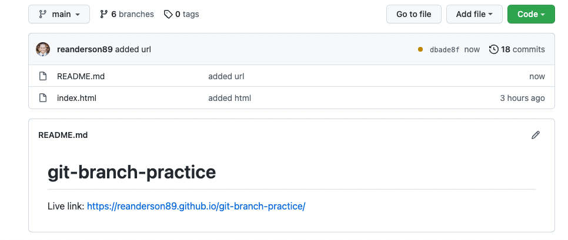

# Deploying to github pages

**1. Create a new repository, clone it, add an index.html, add something to the body of the HTML (could be `<h1>Your Name</h1>`, could be an `` of something. You might have to google or use other README's if your unsure.), push your changes to github.**

**2. In your repository on github, go to the "Settings" tab, then click the "Pages" tab on the left.**

**3. Under Source, click where it says "none" and select "main", then click save.**

 
 

**4. This will produce a URL to a live page just above the dropdown menu you clicked on. It may not work for a minute or two while it has the blue background color.**

 

**5. Refresh the page after a minute or two and you will notice that the background for the URL is now green. Click the URL to test that it works then add it to your README.md.**

**6. After you have added your URL to your README.md, push those changes to github. You should now see the live link on your repository home page on github.**

 

**7. Lastly, submit the URL for your live page for attendance.**

## BONUS

**Make your font style italic and/or bold on your README.md**

**Take a screenshot of your live page and display it on your README.md**

